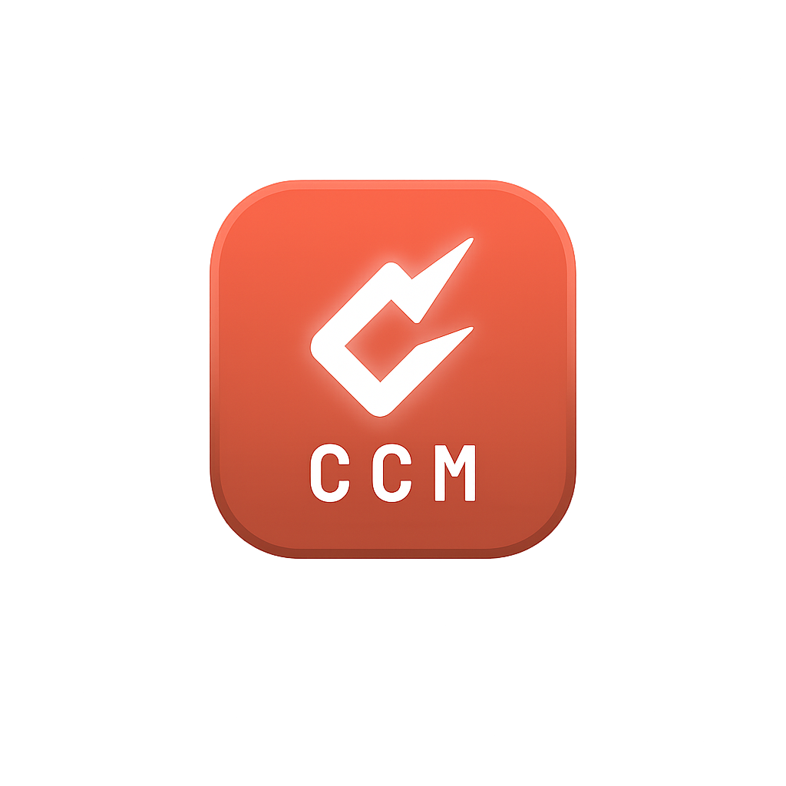

<div align="center">



# Claude Code Multi-Provider (Windows)

Run **[Claude Code](https://docs.claude.com/en/docs/claude-code)** with many AI providers, chosen from a small point-and-click app — no editing config files by hand.

</div>

DeepSeek is the everyday default; other providers are one click away. A tiny WinForms **Provider Manager** lets you paste keys, switch providers, change models, run an inline connection test, and pick which provider `claude` uses in a plain terminal. Everything is stored as your Windows user environment variables, so it survives reboots. Most providers need **no background service**; the **native-key** providers spin up a small **local proxy** only while one of them is active.

  

> **Not affiliated with Anthropic, OpenRouter, or any model provider.** "Claude Code" is Anthropic's product; this is an independent helper that configures it. The bundled icons/name are used to identify the tool this configures.

---

## What you get

- **One-click installer** — sets DeepSeek as the default and creates two Desktop icons.
- **Two Desktop shortcuts:** **Claude Code** (start coding immediately) and **Claude Code Manager** (the GUI).
- **18 providers across four kinds** (see below).
- **Free-type model box**, inline **Test connection**, **Make this my terminal default**, and **Clear key** buttons.

## Four kinds of providers — and an honest caveat

**1. Direct (each uses its own API key), native Anthropic-compatible endpoints:**
DeepSeek, GLM (Z.ai), Kimi (Moonshot), Qwen (Alibaba), MiniMax, Anthropic (Claude).

**2. OpenRouter (one key, every model):**
A single **OpenRouter** provider — no more per-vendor entries. Reached through OpenRouter's Anthropic-compatible endpoint (`https://openrouter.ai/api`). The Model box is populated **live from OpenRouter's catalogue** (click *Refresh models*), so you can pick or type **any** slug — including free `:free` models. Free models are supported; the Manager lowers the requested output cap to 4k for `:free` slugs so small-context free models don't 400.

**3. Native key via local claude-code-router (NEW):**
Use a provider's **own** API key — *without* going through OpenRouter. There are ready-made presets for **Mistral, OpenAI, Groq, xAI (Grok), Together AI, DeepInfra, Cerebras, Fireworks, and a local Ollama** (each pre-wired with the right endpoint — just paste that provider's key), plus a generic **OpenAI-compatible (any)** entry where you type any base URL for anything else that speaks OpenAI Chat Completions. CCM runs a small [claude-code-router](https://github.com/musistudio/claude-code-router) proxy (Node.js) **locally on `127.0.0.1:3456`** that translates between Claude Code's Anthropic protocol and the provider's OpenAI format. It's lightweight, starts fast, runs **only while a native-key provider is active**, and is installed automatically on first use (needs Node.js). Nothing is sent to any third party — the proxy talks straight from your machine to the provider with your key.

**4. Custom (any Anthropic-compatible endpoint you enter):**
Point the Manager at any base URL + token — subscription "coding plans", self-hosted gateways, etc. `https` is required. Test connection now **auto-detects** whether the endpoint wants an `x-api-key` or a `Bearer` token and remembers it, which fixes custom endpoints (e.g. a DeepSeek `…/anthropic` base) that previously configured but wouldn't connect.

> ⚠️ **The agent-loop caveat still applies to non-Anthropic models.** Claude Code depends on faithful Anthropic-format **tool use** (reading files, running bash, applying edits). A model that doesn't implement tool-calling faithfully can appear to work and then **silently drop tool-call results**: Claude Code "forgets" files, won't run commands, or loops. claude-code-router translates through **OpenAI Chat Completions**, the dialect nearly every provider implements — but the *model* still has to support tool use. For agentic coding, prefer **direct** providers (DeepSeek, GLM, Kimi, Qwen), **Anthropic**, or coding-tuned, tool-capable models. Treat others as experimental for multi-step work.

## Notifications — hear when Claude needs you (NEW)

Give Claude Code a long task and walk away; CCM can play a sound when it **needs your input** (a permission prompt / question) and another when a **task finishes**. In the Manager's *Notifications* box, pick a built-in sound (Ping, Bell, Blip, Chime), choose **Custom file…** to use your own `.wav`/`.mp3`/song, or leave it **Off** (the default). Saving wires two [Claude Code hooks](https://docs.claude.com/en/docs/claude-code/hooks) (`Notification` and `Stop`) into your `~/.claude/settings.json` — merged non-destructively, so any hooks you already have are preserved. Sounds play in the background (no extra window) and **stop a playing sound** three ways: press **Ctrl + Alt + S** anytime, click **Stop sound**, or close that session's Claude Code window. Entirely optional; the normal silent flow is unchanged when both are Off.

## Requirements

- Windows 10/11, PowerShell 5.1+ (built in).
- **Claude Code** already installed — native (`%USERPROFILE%\.local\bin\claude.exe`) or npm-global (`%APPDATA%\npm`). The installer resolves it via `Get-Command claude` and both known locations; it does **not** install Claude Code.
- API keys for whichever providers you use (DeepSeek to start).

## Quick start

1. Download this repo (green **Code** button → Download ZIP, or `git clone`).
2. Double-click **`install.bat`**.
3. Open **Claude Code Manager**, pick a provider, paste its key, click **Save key and model**.
   - For **OpenRouter**, paste your OpenRouter key once, then pick or type any model slug (click *Refresh models* for the live list, incl. `:free`).
   - For a **native-key** provider (Mistral, OpenAI, Groq, …), paste that provider's own key; the local claude-code-router proxy is set up automatically on first Launch (needs Node.js).
4. Click **Test connection** (result shows inline: green *connected OK*, or red with the exact HTTP error), then **Launch Claude Code**.
5. Or double-click **Claude Code** to start with your terminal default. (If you haven't saved a key yet, the launcher tells you to open the Manager first instead of failing with a cryptic error.)

## The Manager, button by button

- **Save key and model** — stores this provider's key + model. Won't save a blank/placeholder key, and warns if a key doesn't match the expected shape (OpenRouter `sk-or-v1-…`, Anthropic `sk-ant-…`).
- **Clear key** — removes a saved key (e.g. you pasted the wrong one).
- **Test connection** — makes a captured request to the provider and reports success/exact error inline (no terminal to read).
- **Make this my terminal default** — points the persistent `ANTHROPIC_*` variables at the selected provider, so `claude` in **any** new terminal uses it. Previously only DeepSeek could be the terminal default; now any provider can.
- **Launch Claude Code** — opens a session on the selected provider without changing your terminal default.

## Providers & default models

| Provider | Connection | Default model (editable) |
|---|---|---|
| DeepSeek | direct | `deepseek-v4-pro[1m]` (1M ctx; fast: `deepseek-v4-flash`) |
| GLM (Z.ai) | direct | `glm-5.2` |
| Kimi (Moonshot) | direct | `kimi-k3` |
| Qwen (Alibaba) | direct | `qwen3.8-max` (coding: `qwen3-coder-plus`) |
| MiniMax | direct | `minimax-m2.7` |
| Anthropic (Claude) | direct | `claude-opus-4.7` |
| **OpenRouter** | OpenRouter (one key, all models) | any slug — live list, incl `:free` |
| **Mistral** (native key) | local claude-code-router | `mistral-large-latest`, `codestral-latest`, … |
| **OpenAI** (native key) | local claude-code-router | `gpt-4o`, `gpt-4.1`, `o4-mini`, … |
| **Groq** (native key) | local claude-code-router | `llama-3.3-70b-versatile`, `qwen-2.5-coder-32b`, … |
| **xAI Grok** (native key) | local claude-code-router | `grok-2-latest`, … |
| **Together AI** (native key) | local claude-code-router | `meta-llama/Llama-3.3-70B-Instruct-Turbo`, … |
| **DeepInfra** (native key) | local claude-code-router | `meta-llama/Llama-3.3-70B-Instruct`, … |
| **Cerebras** (native key) | local claude-code-router | `llama-3.3-70b`, … |
| **Fireworks** (native key) | local claude-code-router | `accounts/fireworks/models/…` |
| **Ollama** (local, native) | local claude-code-router | `qwen2.5-coder`, `llama3.3`, … (any key value) |
| **OpenAI-compatible (any)** | local claude-code-router | you type the base URL + model |
| Custom | any Anthropic-compatible endpoint | whatever the endpoint expects |

Model names change; the Model box is free-type. For OpenRouter, click **Refresh models** to pull the current catalogue, or browse slugs at [openrouter.ai/models](https://openrouter.ai/models). For native-key providers, common base URLs are shown in the Manager (Mistral `https://api.mistral.ai/v1`, OpenAI `https://api.openai.com/v1`, Groq `https://api.groq.com/openai/v1`, Together `https://api.together.xyz/v1`, Ollama `http://localhost:11434/v1`).

## Security — the honest version

Your keys are **not** stored in this repository. They are saved as your **Windows user environment variables** (`HKCU\Environment`), in **plaintext**, and are **inherited by every process you launch** — not just Claude Code. So once you've saved several providers, all those keys sit in the environment of every program you start from that user session. *Not in the repo* is true; *not exposed on your machine* is not.

Why it's done this way: Claude Code (and the bare `claude` command in any terminal) reads the token from the ambient environment, so the token has to live there for the "just type `claude`" experience to work. A stronger design would keep keys encrypted at rest (Windows **DPAPI** or **Credential Manager**) and only materialize them into the child process at launch — which the Manager already does per session — but that breaks the bare-terminal path. It's a real trade-off, not a free win. If you're security-sensitive: use the Manager's **Launch**/**Clear key** flow, don't set a terminal default, and remove keys you're done with.

## How it works

- Sets permanent user env vars so `claude` uses your default provider, plus off-Anthropic flags: `CLAUDE_CODE_DISABLE_NONESSENTIAL_TRAFFIC=1` (stop pinging Anthropic's non-inference endpoints when you're not on Anthropic) and `CLAUDE_CODE_AUTO_COMPACT_WINDOW=786432` (don't compact 1M-context sessions early).
- Sets `hasCompletedOnboarding` in `~/.claude.json` so Claude Code doesn't stall on a login screen with third-party providers.
- The Manager injects the chosen provider's endpoint/key/model into that session only, broadcasts `WM_SETTINGCHANGE` after edits, and is DPI-aware for high-scaling laptops.

## Uninstall

```powershell
powershell -NoProfile -ExecutionPolicy Bypass -File uninstall.ps1
```
Removes the shortcuts, the Manager app folder, and this project's env vars (including saved keys). Claude Code itself is left alone.

## Troubleshooting

- **`Unable to connect to API (ConnectionRefused)`** — a stale `ANTHROPIC_BASE_URL`/gateway override in `~/.claude/settings.json` (e.g. from a local-router experiment) is overriding your env. Run **`repair.ps1`**; it backs up and cleans it and resets the default to DeepSeek.
- **Non-Anthropic model "forgets" files or won't run bash** — that's the agent-loop/tool-use caveat above. Switch to a direct provider or a coding-tuned model.
- **`model not found`** — type the current model id/slug in the Model box.
- **`400 ... maximum context length is 32768 tokens ... you requested ~55863`** — the model you chose is served with a small context window, but Claude Code sends ~20k of tool schemas plus requested output. Pick a **large-context** model: on OpenRouter, Qwen's `qwen/qwen3-coder-plus` / `qwen/…-max` slugs serve ~1M tokens. The Manager also caps requested output to **8k** on OpenRouter routes, which fits a 32k window.
- **`402 ... requires more credits, or fewer max_tokens ... you can only afford N`** — the OpenRouter model is **paid** and your OpenRouter balance is low, so it limits how many output tokens you can request. Add a few dollars of credit at [openrouter.ai/settings/credits](https://openrouter.ai/settings/credits), pick a **`:free`** model, or use a **direct** provider (e.g. your DeepSeek key). Note: not every vendor has a free slug on OpenRouter at any given time.
- **Test connection is green but a real turn fails** — the connection test sends a tiny request, so it passes even when a full turn would hit the 400/402 above. Fix it by switching to a large-context model and/or adding credits as noted.

## Files

| File | Purpose |
|---|---|
| `install.bat` | Double-click launcher for the installer |
| `install-claude-code-providers.ps1` | Env + PATH + flags, onboarding fix, installs Manager + icons + shortcuts |
| `ClaudeCodeManager.ps1` | The Provider Manager GUI |
| `claude-code.ico` / `ccm.ico` | Icons for the Claude Code and Manager shortcuts |
| `repair.ps1` | Fixes the ConnectionRefused / stale-settings override |
| `uninstall.ps1` | Removes shortcuts, app folder, env vars, proxy data, and sound hooks |
| `scripts/ccm-proxy-lib.ps1` | Installs/starts/stops the local claude-code-router for native-key providers |
| `scripts/ccm-notify.ps1` | Plays the notification sound (called by Claude Code hooks) |
| `assets/sounds/` | Built-in notification sounds (`ping`, `bell`, `blip`, `chime`) |
| `assets/` | Logos and screenshots |

## Native-key providers — requirements & notes

- Needs **Node.js** on PATH (most Claude Code setups already have it). First time you Launch a native-key provider, CCM runs `npm install -g @musistudio/claude-code-router@1.0.73` automatically (one-time, a few seconds).
- The router binds to `127.0.0.1:3456` only and is started/stopped by CCM (it manages its own background service, so it survives the Manager closing). Switching to any non-proxy provider stops it.
- Router config is written to `%USERPROFILE%\.claude-code-router\config.json`; CCM's start/stop logs go to `%LOCALAPPDATA%\CCM\ccr.log`.

## Credits

Multi-model routing for the non-native providers uses [OpenRouter](https://openrouter.ai). Not affiliated with Anthropic, OpenRouter, or the model providers.

## License

MIT — see [LICENSE](LICENSE).
